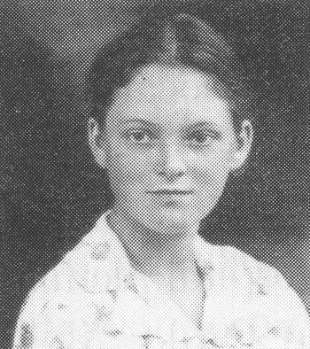

# Sonja Ashauer

Nascimento: 9 de abril de 1923 em São Paulo, São Paulo

Falecimento: 21 de agosto de 1948 em São Paulo, São Paulo

## Biografia

Sonja nasceu em São Paulo, filha do engenheiro de origem alemã Walter Ashauer 
e de Herta Graffenbenger. Ela ingressou no curso de física na Faculdade de Filosofia, 
Ciências e Letras da Universidade de São Paulo em 1940, graduando-se bacharel em 1942.
Sonja foi a segunda mulher a se graduar em física no Brasil, a primeira sendo Elisa 
Frota Pessôa pela então Universidade do Brasil (hoje Universidade Federal do Rio de Janeiro)
ambas no mesmo ano. Por se destacar como estudante, foi convidada por Gleb Wataghin 
para que fosse assistente de sua cadeira de Física Teórica e Matemática. Nesse período, 
Sonja "estudou o problema da origem do elementos e pesquisou sobre raios cósmicos".

Em 1945, ela recebeu uma bolsa do British Council, para realizar o seu doutorado 
na Universidade de Cambridge, na qual ela pertenceu ao Newnham College.
Em Cambridge, Sonja estudou sob a orientação do então já prêmio Nobel, Paul Dirac. 
Durante sua estadia na Grã-Bretanha, Sonja trabalhou na teoria clássica do 
elétron e no problema de reação à radiação no eletromagnetismo clássico. 
Esses estudos resultaram em um artigo nos Proceedings of the Royal Society A e 
dois nos Proceedings of the Cambridge Philosophical Society.
A sua tese de doutorado *"Problems on electrons and electromagnetic radiation"* 
foi defendida em fevereiro de 1948 e a fez a primeira doutora em física brasileira. 
Além disso, Sonja também foi nomeada membro da Cambridge Philosophical Society.

Após defender seu doutorado (e apesar do convite de Dirac para continuar a colaboração 
científica nos EUA) Sonja regressou ao Brasil em março de 1948, onde se juntou ao grupo de 
Wataghin na Universidade de São Paulo. Infelizmente, após apenas cinco meses do seu 
retorno, uma gripe logo se tornou uma pneumonia e Sonja faleceu precocemente em agosto de 1948.

Fechamos essa breve biografia com uma elogiosa citação de Dirac sobre Sonja, que 
resume suas qualidades como pesquisadora e que também dá margem para imaginarmos o que ela 
poderia ter alcançado se não tivesse falecido aos 25 anos. Segundo Dirac ela foi: 

> "sempre muito industriosa e aguda em seu trabalho, e fez úteis contribuições à ciência, que 
> sobreviverão em seus trabalhos publicados."

## Bibliografia
* Ciência para todos: Suplemento de Divulgação Científica
da "A Manhã",
[Sonja Ashauer](http://memoria.bn.br/DocReader/hotpage/hotpageBN.aspx?bib=085782&pagfis=138&pesq=&url=http://memoria.bn.br/docreader#) 
(1948)

* Rádio CNPq, *Pioneiras da Ciência* Ep.17, [Sonja Ashauer](https://soundcloud.com/user-349483946/pioneiras-da-ciencia_sonja-ashauer_ep-17)

* Sonja Ashauer, [Wikipedia](https://pt.wikipedia.org/wiki/Sonja_Ashauer) 
(página consultada em março de 2019)

* S. Ashauer, *Problems on electrons and electromagnetic radiation* [Doctoral thesis](https://www.repository.cam.ac.uk/handle/1810/250953) 
University of Cambridge (1948).

* S. Ashauer, [*On the self-accelerating electron*](https://doi.org/10.1017/S0305004100023768),
Proc. Cambridge Phil. Soc. **43** 506-510 (1947)

* S. Ashauer, [*A Generalization of the Method of Separating Longitudinal and 
Transverse Waves in Electrodynamics*](https://royalsocietypublishing.org/doi/abs/10.1098/rspa.1948.0074), 
Proc. R. Soc. Lond. A **194** 206-217 (1948)

* S. Ashauer, [*On the classical equations of motion of radiating electrons*](https://doi.org/10.1017/S0305004100025081),
Proc. Cambridge Phil. Soc. **45** 463-475 (1949)
